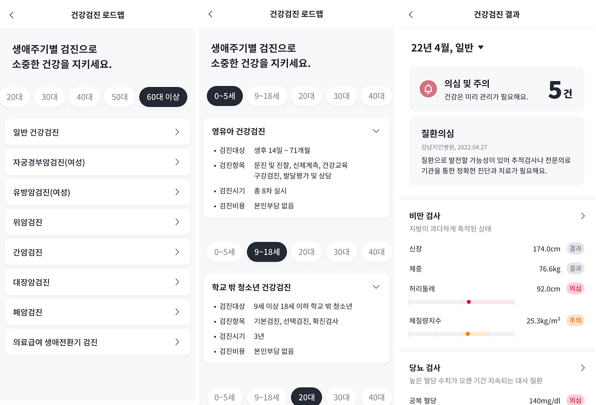
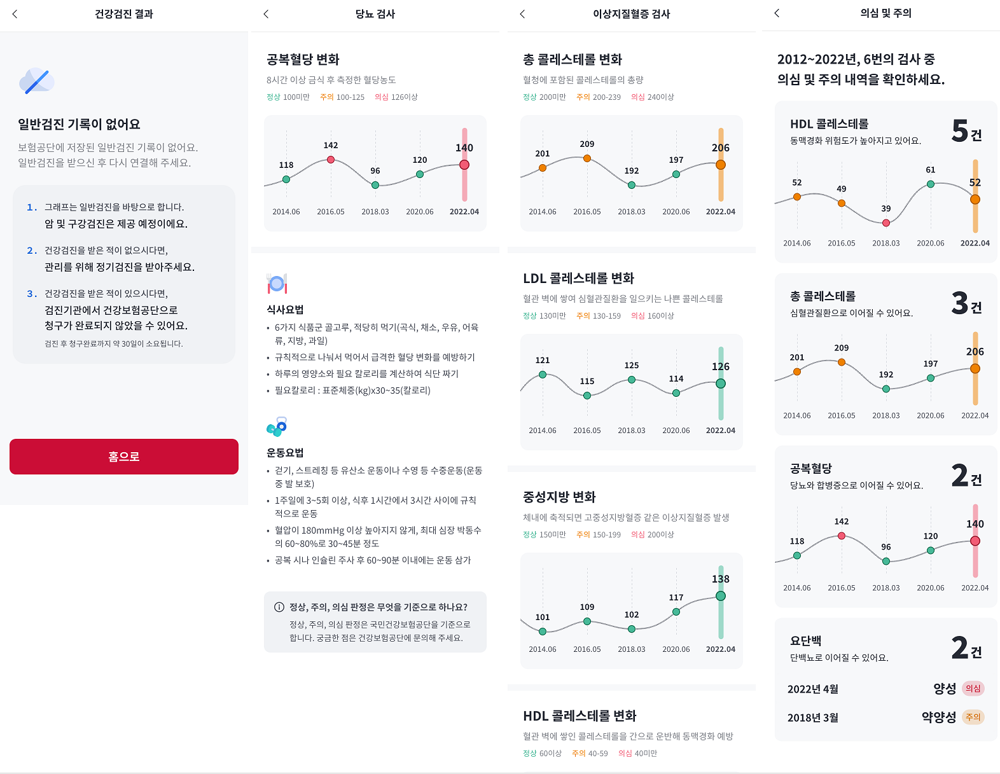

# 인바디앱 마이 헬스 데이터 ( 하이브리드 앱 )
> 보안상 코드는 업로드가 불가하여, 이미지로 대체.
---

- ### 목차

**[1. 프로젝트 정보](#1-프로젝트-정보)**

**[2. 주요기능 및 스크린샷](#2-주요기능-및-스크린샷)**

---

## 1. 프로젝트 정보

**프로젝트기간** **:**
- 2022.06

**팀 구성원** **:**
- 총 4명
  - Front-end : 1명
  - Back-end : AOS 개발자 1명, IOS 개발자 1명
  - Server : 1명

**사용 언어 및 툴** **:** 
- HTML
- CSS
- Vanilla JS
- Canvas
- vsCode

**목적** **:** 
- 건강 보험 공단에서 제공하는 정보를 활용하여 사용자가 보다 쉽게 본인의 건강 상태를 확인 및 개선 할 수 있도록 하기 위함.

## 2. 주요기능 및 스크린샷

> 건강검진 로드맵을 통해 각 연령대별 추천 검진과 해당 검진의 상세 정보를 확인 가능.

> 현재까지 진행했던 건강 검진 기록들의 정보를 직관적으로 보여줄 수 있도록 바 그래프와 곡선 그래프를 활용하여 제공.  *곡선 그래프는 canvas에 베지에 곡선 공식을 사용하여 개발. ( 라이브러리는 사용하지 않음 )
> 
> 